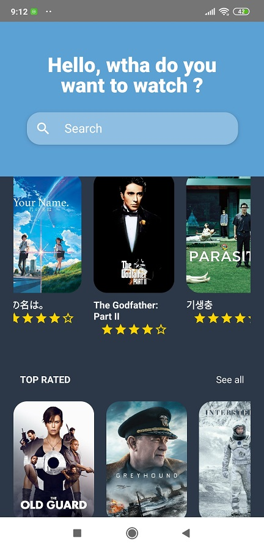

# Ejemplo React Native

La prueba consiste en construir el diseño de **2 pantallas** implementando el Tema Light y Dark de las aplicaciones

móviles, de forma sencilla según el siguiente diseño:

> [Demo Template](https://www.uplabs.com/posts/movies-e0f9c1ea-a644-4666-857b-10933c4089ca)

La información de las películas que van en ese diseño debe venir desde esta api:
>[API Developers](https://developers.themoviedb.org/3/getting-started/introduction)

| Puntos a evaluar | Estado |
|--|--|
| Usar react Hooks y Redux | listo |
| Usar CSS en JS, por ejemplo como styled-components, JSS etc... | listo |
| Usar eslint, standard y/o prettier. | listo |
| No usar ningún boilerplate ni starter tales como create-react-app | listo |

# Comandos utiles
instalar dependencias
```bash
yarn
```
correr proyecto
```
npm run android
```
generar APK
```
cd android
gradlew clean
gradlew assembleRelease
```

